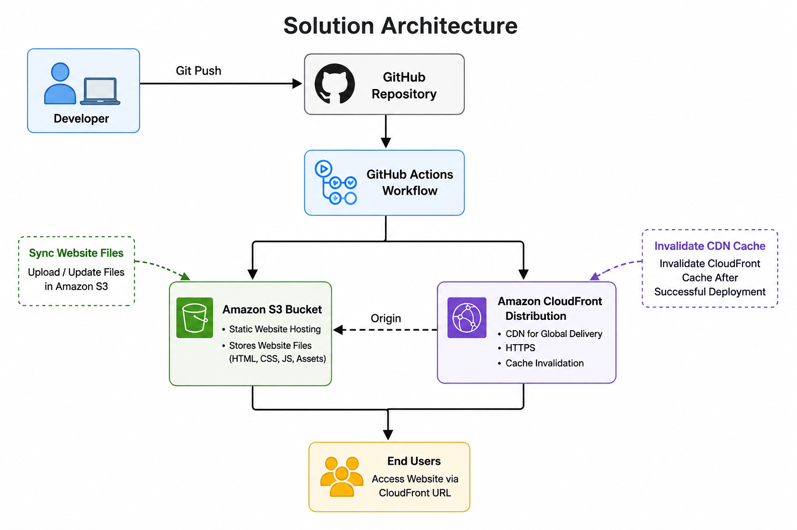
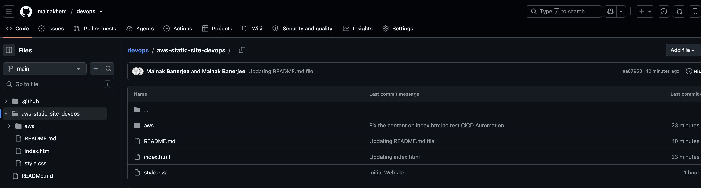
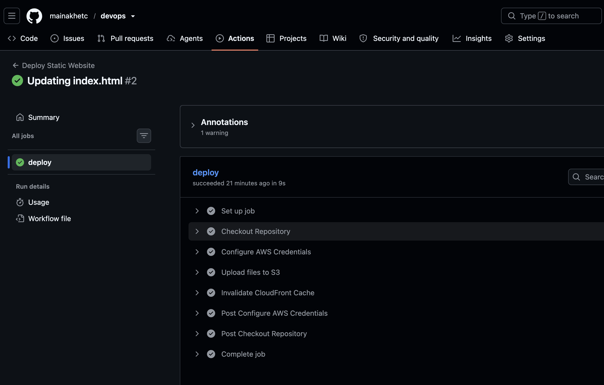
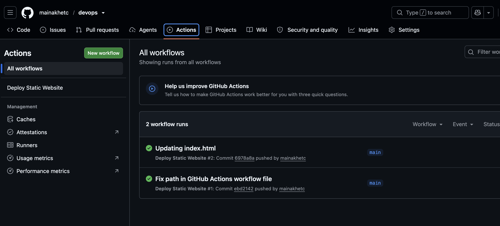
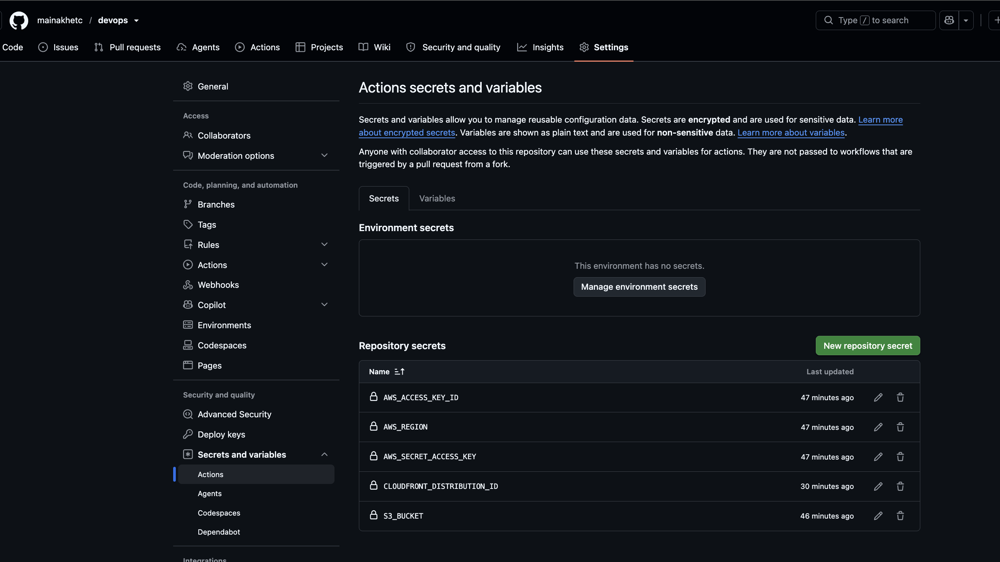
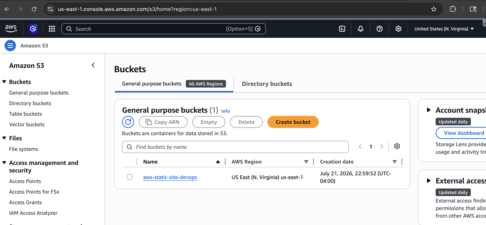
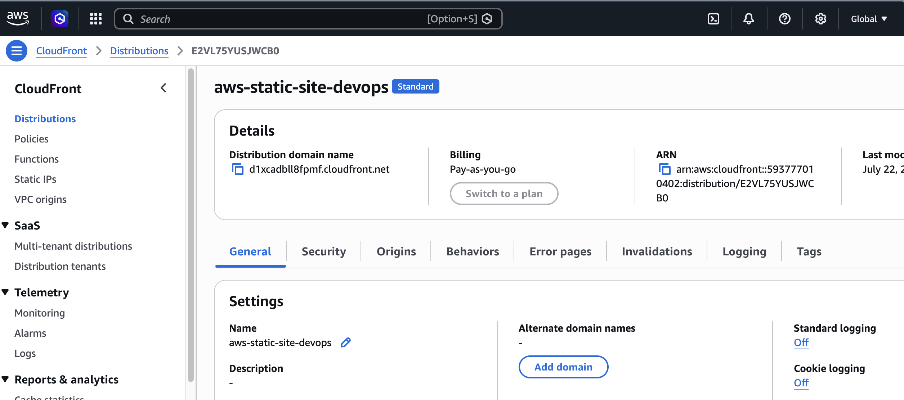
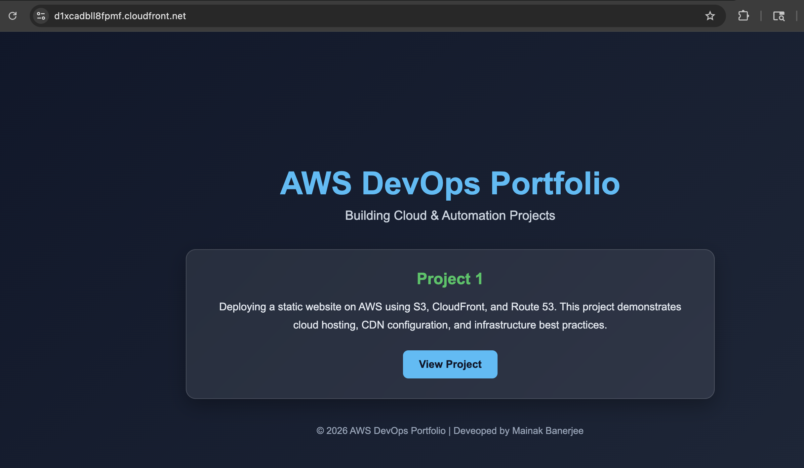

# AWS Static Website CI/CD Pipeline

# Project Status

✅ Completed

Last Updated: July 2026

# Project Overview

This project demonstrates how to automate the deployment of a static website using AWS and GitHub Actions. Every code change pushed to the GitHub repository is automatically deployed to Amazon S3, and the Amazon CloudFront cache is invalidated so users always receive the latest version of the website.

The objective of this project is to gain practical experience with modern DevOps practices including Continuous Integration (CI), Continuous Deployment (CD), cloud storage, CDN configuration, IAM security, and deployment automation.

---

# Solution Architecture

```



```

---

# Technologies Used

| Category | Technologies |
|----------|--------------|
| Cloud Platform | Amazon Web Services (AWS) |
| Storage | Amazon S3 |
| CDN | Amazon CloudFront |
| Identity & Security | AWS IAM |
| CI/CD | GitHub Actions |
| Automation | AWS CLI |
| Version Control | Git & GitHub |
| Frontend | HTML5, CSS3 |

---

# Key Features

- Automated CI/CD pipeline
- Static website hosting on Amazon S3
- Global content delivery with CloudFront
- Secure authentication using GitHub Secrets
- Automatic cache invalidation
- Version-controlled deployments
- Production-inspired deployment workflow

---

# Workflow

1. Developer pushes code to GitHub.
2. GitHub Actions workflow is triggered.
3. Repository code is checked out.
4. AWS credentials are securely loaded from GitHub Secrets.
5. Website files are synchronized to the Amazon S3 bucket.
6. CloudFront cache is invalidated.
7. Updated website becomes available globally.

---

# Challenges Encountered

• CloudFront Access Denied
  → Resolved by configuring the S3 bucket policy and origin settings.

• Incorrect Distribution ID
  → Updated the GitHub Secret and reran the workflow.

• Git push rejected
  → Resolved by synchronizing the local and remote repositories.

---

# Screenshots

# Repository Structure



# Successfull Deployment



# GitHub Actions Workflow



# GitHub Secrets



# Amazon S3 Bucket



# Amazon CloudFront Destributiom



# Website Homepage



---

# AWS Services Used

### Amazon S3

* Static website hosting
* Stores website files

### Amazon CloudFront

* Content Delivery Network (CDN)
* HTTPS support
* Global caching
* Faster website delivery

### AWS IAM

* Secure programmatic access
* Least-privilege authentication (recommended for production)

---

# GitHub Actions Workflow

The deployment pipeline performs the following tasks automatically:

* Checks out the repository
* Configures AWS credentials
* Synchronizes website files to Amazon S3
* Invalidates the CloudFront cache

Deployment is triggered automatically whenever code is pushed to the main branch.

---

# Security

AWS credentials are stored securely using GitHub Secrets.

The following secrets are configured:

* AWS_ACCESS_KEY_ID
* AWS_SECRET_ACCESS_KEY
* AWS_REGION
* S3_BUCKET_NAME
* CLOUDFRONT_DISTRIBUTION_ID

No sensitive information is stored in the source code repository.

---

# Future Improvements

* Register a custom domain
* Configure Route 53
* Add SSL certificate using AWS Certificate Manager
* Deploy using Terraform
* Enable monitoring with Amazon CloudWatch
* Add automated testing before deployment
* Implement least-privilege IAM policies

---
